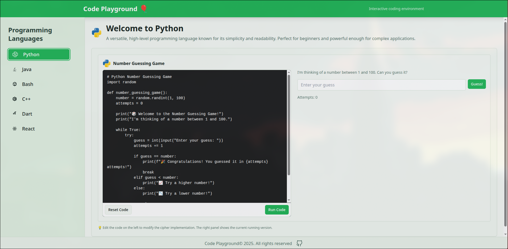

# Code Playground

<div align="center">
  
  
  <p align="center">
    <strong>A modern, interactive coding environment for multiple programming languages</strong>
  </p>
  
  <p align="center">
    <a href="#-features">Features</a> •
    <a href="#-quick-start">Quick Start</a> •
    <a href="#-usage">Usage</a> •
    <a href="#-technology-stack">Tech Stack</a> •
    <a href="#-contributing">Contributing</a>
  </p>
</div>

---

## 📊 Tech Stack

<div align="center">
  
</div>

<div align="center">
  
  [](https://www.typescriptlang.org/)
  [](https://reactjs.org/)
  [](https://vitejs.dev/)
  [](https://tailwindcss.com/)
  
</div>

---

## ✨ Features

<table>
<tr>
<td width="50%">

### 💻 Multi-Language Support


- **Python** - Dynamic scripting with extensive libraries
- **Java** - Enterprise-grade object-oriented programming
- **C++** - High-performance system programming
- **Bash** - Powerful shell scripting
- **Dart** - Modern language for Flutter development
- **React** - Interactive component development

</td>
<td width="50%">

### 🎯 Core Capabilities

- **Real-time Execution** - Instant code compilation and output
- **Syntax Highlighting** - Beautiful code presentation
- **Theme Switching** - Seamless light/dark mode
- **Responsive Design** - Works on all device sizes
- **Live Preview** - Real-time React component rendering
- **Fun Facts** - Learn while you code

</td>
</tr>
</table>

---

## 🚀 Quick Start

Get up and running in minutes:

```bash
# Clone the repository
git clone https://github.com/nveed-gung/Code-Playground.git

# Navigate to project directory
cd Code-Playground

# Install dependencies
npm install

# Start the development server
npm run dev
```

Your application will be live at `http://localhost:5173` 🎉

---

## 📖 Usage

### 1️⃣ Select Your Language

Navigate through the intuitive sidebar and choose your preferred programming language. Each language environment is specially crafted for optimal coding experience.

### 2️⃣ Write & Execute

```typescript
// Use the feature-rich code editor
const code = "Your awesome code here";
// Real-time syntax highlighting included
```

Click the **Run** button to execute your code instantly.

### 3️⃣ View Results

- Immediate output display in the results panel
- Clear error messages and debugging information
- Formatted output for better readability

### 4️⃣ Explore Features

- **Theme Toggle** - Switch between light and dark modes
- **Interactive Elements** - Click the balloon for programming facts
- **Demo Code** - Learn from built-in implementations

---

## 🛠 Technology Stack

<div align="center">

| Category | Technologies |
|----------|-------------|
| **Frontend** |  React, TypeScript |
| **Build Tool** |  Vite |
| **Styling** |  Tailwind CSS, Shadcn/ui |
| **Animation** | Framer Motion |
| **Icons** | Lucide React |
| **Code Execution** | JDoodle API |

</div>

---

## 🎨 Features in Detail

### 🔥 Advanced Code Editor

- **Intelligent Highlighting** - Language-specific syntax coloring
- **Auto-completion** - Smart code suggestions
- **Error Detection** - Real-time error highlighting
- **Code Formatting** - Clean and readable code structure

### 🌐 Secure Execution Environment

- **Remote Execution** - Safe, sandboxed code running
- **Fast Response** - Optimized for quick results
- **Error Handling** - Comprehensive error messages
- **Output Formatting** - Structured result display

### 🎭 User Experience

- **Fluid Animations** - Smooth transitions and interactions
- **Responsive Layout** - Mobile, tablet, and desktop optimized
- **Accessibility** - WCAG compliant design
- **Performance** - Optimized loading and execution

---

## 📁 Project Structure

```
Code-Playground/
├── src/
│   ├── components/     # React components
│   ├── lib/           # Utility functions
│   ├── hooks/         # Custom React hooks
│   └── types/         # TypeScript definitions
├── public/            # Static assets
└── package.json       # Dependencies
```

---

## 🤝 Contributing

We love contributions! Here's how you can help make Code Playground even better:

### Steps to Contribute

1. **Fork** the repository
2. **Create** a feature branch
   ```bash
   git checkout -b feature/amazing-feature
   ```
3. **Commit** your changes
   ```bash
   git commit -m 'Add: amazing feature description'
   ```
4. **Push** to your branch
   ```bash
   git push origin feature/amazing-feature
   ```
5. **Open** a Pull Request

### Contribution Guidelines

- Write clear commit messages
- Follow the existing code style
- Add tests for new features
- Update documentation as needed
- Keep pull requests focused and concise

---

## 📋 Roadmap

- [ ] Add more programming languages (Go, Rust, Ruby)
- [ ] Implement code sharing functionality
- [ ] Add collaborative coding features
- [ ] Create mobile applications
- [ ] Integrate AI-powered code suggestions
- [ ] Add code snippet library

---

## 📄 License

This project is licensed under the **MIT License** - see the [LICENSE](LICENSE) file for complete details.

---

## 🙏 Acknowledgments

Special thanks to these amazing projects and services:

<div align="center">
  
| Project | Purpose |
|---------|---------|
| [JDoodle](https://www.jdoodle.com/) | Secure code execution API |
| [Shadcn/ui](https://ui.shadcn.com/) | Beautiful, accessible UI components |
| [Framer Motion](https://www.framer.com/motion/) | Fluid animations and transitions |
| [Lucide](https://lucide.dev/) | Crisp, customizable icons |

</div>

---

## 📧 Contact & Support

<div align="center">
  
  **Have questions or suggestions?**
  
  [Report Bug](https://github.com/nveed-gung/Code-Playground/issues) • [Request Feature](https://github.com/nveed-gung/Code-Playground/issues) • [Discussions](https://github.com/nveed-gung/Code-Playground/discussions)
  
</div>

---

<div align="center">
  
  ### Made by Naveed
  
  
  
  **⭐ Star this repo if you find it helpful!**
  
</div>
